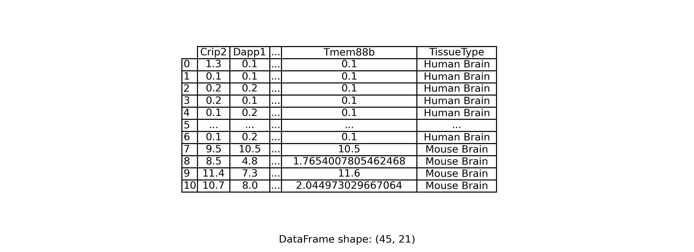

# Goal: Build a cross-species tissue classifier

## Removing Outliers in Gene Expression Data:

### 1. Why Address Outliers?
- **Definition**: Outliers are extreme values.
- **Causes**:
  - Technical errors during data collection.
  - Genuine biological variations.
- **Impact**: While genuine variations offer insights, technical errors can distort analyses.

### 2. Why Remove Outliers Early?
- **Benefits of early removal**:
  - Ensures accurate statistical measures.
  - Provides clear visualizations.
  - Optimizes model performance.

### 3. Approach to Outlier Removal:

#### 3.1 IQR Method:

- **Method**: Employed the IQR to identify outliers, defined by values outside the range `[Q1 - 1.5 x IQR, Q3 + 1.5 x IQR]`.
  
- **Strategy**: Imputed outliers with the mean of non-outlier values, rather than deletion.

- **Observations**:
   - Visualizations showed pronounced changes in data distribution post-imputation.
   - This method concentrated data around the mean, which might overshadow genuine biological variations.
  
- **Considerations**: While effective in handling extreme values, it's essential to recognize the method's impact on data distribution. Alternatives or additional analyses might be necessary, especially when considering the biological significance of detected outliers.

- **Visualization**: Below is a boxplot showcasing the distribution of a randomly selected gene column before and after outlier imputation using the IQR method.

#### 3.2 Modified Z-Score Method:

- **Method**: Utilized the Modified Z-Score to detect outliers. The formula for the Modified Z-Score is:
   $$M_i = 0.6745 \times \frac{(X_i - \text{Med})}{\text{MAD}}$$
  where $X_i$ is the data point, $\text{Med}$ is the median of the data, and $\text{MAD}$ is the Median Absolute Deviation.

- **Strategy**: Imputed outliers, identified as those with a Modified Z-Score greater than 3.5, with the mean of non-outlier values.

- **Observations**:
   - **Outlier Detection**: The Modified Z-Score method identified more outliers compared to the IQR method. This could be because the Modified Z-Score is more sensitive, especially in datasets that don't strictly follow a normal distribution.
   - **Data Distribution**: Post-imputation visualizations show a more natural spread of data values, unlike the concentration around the mean observed with the IQR method.
- **Considerations**: While this method was effective in detecting and handling outliers, it's crucial to exercise caution. Given the sensitivity of the Modified Z-Score method, there's a risk of misclassifying genuine extreme values as outliers. It's essential to ensure that we are not discarding biologically significant variations.
- **Visualization**: Below is a boxplot showcasing the distribution of a randomly selected gene column before and after outlier imputation using the Modified Z-Score method.

For the remainder of the project, we will utilize the IQR method for outlier handling.

## Data Transformation and Mapping:

### 4. Data Reorganization and Mapping:

#### 4.1 Rationale for Reorganization:
- **Objective**: To restructure the dataset such that individual genes serve as features, thereby aligning the data format with standard practices for machine learning models.
- **Impact**: This transformation is pivotal for facilitating the application of various computational techniques that require features to be in columnar form.

#### 4.2 Implementation and Challenge:
- **Method**: We transposed the dataset, converting what were originally rows (representing genes) into columns (now representing features). This is a common practice in bioinformatics to prepare data for analysis where samples are instances and gene expressions are features.
- **Challenge**: Post-transposition, the dataset appeared to be significantly reduced in size, showcasing only 46 samples. This is a direct consequence of the original dataset being gene-centric, with genes as rows. Such a transformation often leads to a high-dimensional feature space with a relatively smaller number of samples.
- **Approach to Address Challenge**: To enhance the robustness of the dataset and avoid issues associated with high dimensionality, we are exploring strategies to integrate additional data sources, enriching our sample size.

### 5. Applying the Chi-Square Test for Feature Selection:

#### 5.1 Process:
- **Preparation**: Standardized the feature values to be non-negative to meet the Chi-Square test prerequisites.
- **Selection**: Identified the top 20 genes that exhibit the strongest associations with the cell types of interest.

#### 5.2 Insights from Feature Selection:
- **Relevance**: The selected genes are conjectured to play a pivotal role in the classification and differentiation of cell types, indicating their importance as potential biomarkers.
- **Visualization**: The visual representation of the data, with a focus on the top genes and selected labels, is depicted below:

#### 5.3 Considerations:
- **Biological Significance**: It is imperative to consider the biological implications of the genes selected, ensuring that statistical significance is complemented by biological relevance.
- **Reproducibility**: Our process has been meticulously documented to ensure that the methodology can be consistently reproduced in future studies.

### Conclusion:
The reorganization of the dataset into a gene-feature matrix, followed by astute feature selection, has set the stage for more advanced data analysis. These initial steps are critical for the success of downstream analytical endeavors, ensuring that the foundation upon which we build is both solid and scientifically sound. To address the challenge posed by a limited number of samples, we are actively seeking additional datasets to augment our analysis and bolster the statistical power of our models.
